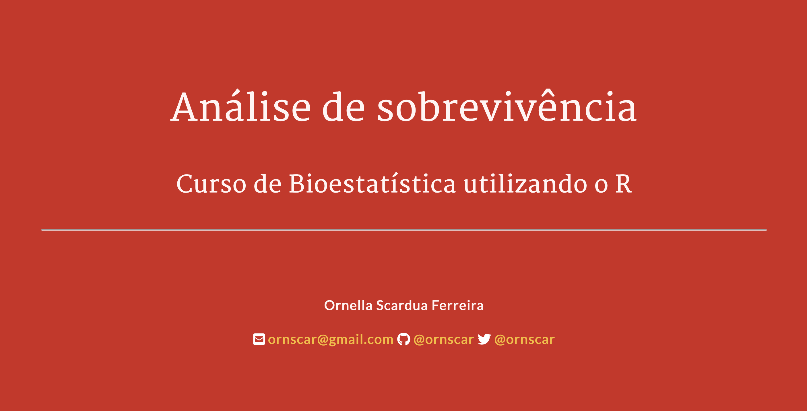

# Análise de sobrevivência

Apresentação da aula **Tema 7 - Análise de Sobrevivência**, do _Curso de Bioestatística utilizando o R_, ofertada para o Programa de Pós-graduação em Saúde Coletiva da Faculdade de Medicina da USP (FMUSP).

